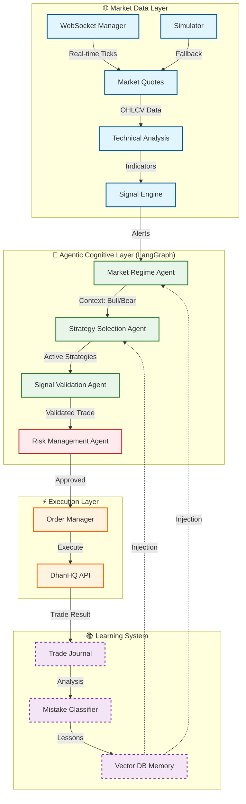

<div align="center">

# 🛡️ RakshaQuant

### Agentic Paper Trading System for NSE

_Where Large Language Models Meet Financial Markets_

[](https://www.python.org/downloads/)
[](https://github.com/langchain-ai/langgraph)
[](https://smith.langchain.com)
[](https://groq.com)
[](https://opensource.org/licenses/MIT)

</div>

---

## 🎯 About This Project

**RakshaQuant** (रक्षा = Protection in Sanskrit) is an autonomous agentic trading system designed for the Indian NSE market. It leverages **LangGraph** to orchestrate a team of specialized AI agents that analyze market data, formulate strategies, validate signals, and manage risk in real-time.

Unlike traditional algorithmic trading that relies solely on hardcoded logic, RakshaQuant introduces **cognitive flexibility**—using LLMs to reason about market regimes (bull/bear/ranging) and adapt its strategies accordingly.

### Key Capabilities

- **🤖 Cognitive Agents**: Multi-agent system that "thinks" before it trades
- **🌐 Live Market Analysis**: Real-time multi-stock monitoring via WebSocket
- **🛡️ Dynamic Risk Management**: Agents that can veto trades based on risk parameters
- **📊 Professional Dashboard**: Real-time CLI interface for monitoring agent thought processes
- **📝 Self-Improving Memory**: Learns from past mistakes using semantic memory

---

## 🏗️ Architecture

RakshaQuant uses a **hierarchical agent graph** where specialized agents collaborate to make trading decisions.



---

## ✨ Features

### 🤖 The Agent Team

| Agent                  | Responsibilities                                                                                         | Model (Groq)    |
| ---------------------- | -------------------------------------------------------------------------------------------------------- | --------------- |
| **Market Regime**      | Analyzes volatility and price action to determine if market is Trending (Up/Down), Ranging, or Volatile. | `llama-3.3-70b` |
| **Strategy Selection** | Selects the best trading strategies (Momentum, Mean Reversion, etc.) for the current regime.             | `llama-3.3-70b` |
| **Signal Validation**  | Reviews technical signals against the current thesis to filter out false positives.                      | `llama-3.3-70b` |
| **Risk Manager**       | Deterministic agent that enforces position sizing, stop-losses, and kill switches.                       | _Rules Engine_  |

### 🖥️ Professional Dashboard

A rich CLI dashboard built with `rich` providing real-time visibility into the system:

- **Market Overview**: Live ticker for 10+ NSE stocks
- **Agent Reasoning**: See _why_ the AI made a decision
- **P&L Tracking**: Real-time unrealized/realized profit monitoring
- **Visual Indicators**: Progress bars for trade confidence and win rates

### 🛡️ Robust Engineering

- **Live/Sim Switch**: Automatically switches to simulated data when markets are closed
- **Rate Limit Handling**: Smart fallback to smaller models (`llama-3.1-8b`) when API limits are hit
- **Confidence Scoring**: Every decision comes with a confidence score (0-100%)
- **Observability**: Full decision traces synced to LangSmith

---

## 🚀 Quick Start

### Prerequisites

- Python 3.12+
- [uv](https://github.com/astral-sh/uv) (recommended) or pip
- [DhanHQ Account](https://dhan.co) (for API access)
- [Groq API Key](https://console.groq.com) (for LLM inference)

### Installation

```bash
# Clone the repository
git clone https://github.com/yourusername/RakshaQuant.git
cd RakshaQuant

# Install dependencies with uv (fast!)
uv sync

# Configure environment
cp .env.example .env
# Edit .env and add your API keys
```

### Running the System

**1. Live Trading System (Recommended)**
Runs the full multi-agent loop with the professional dashboard.

```bash
uv run python scripts/run_live_trading.py
```

**2. Test Connection**
Verify your API credentials are working.

```bash
uv run python scripts/test_dhan_connection.py
```

---

## 📁 Project Structure

```
RakshaQuant/
├── src/
│   ├── agents/              # 🧠 The "Brain" of the system
│   │   ├── market_regime.py
│   │   ├── strategy_selection.py
│   │   ├── signal_validation.py
│   │   └── risk_compliance.py
│   ├── market/              # 🌐 Market Data Handling
│   │   ├── manager.py       # Live/Sim auto-switcher
│   │   ├── websocket_feed.py# DhanHQ WebSocket client
│   │   └── simulated_data.py# Realistic market simulator
│   ├── dashboard/           # 📊 UI Components
│   │   └── cli.py           # Rich terminal dashboard
│   ├── memory/              # 📚 Learning System
│   └── config/              # ⚙️ Configuration
├── scripts/                 # 🏃‍♂️ Entry Points
│   └── run_live_trading.py  # Main application
├── tests/                   # 🧪 Unit Tests
└── README.md
```

---

## 🔍 Observability

RakshaQuant is instrumented with **LangSmith** for full observability. You can trace every thought process of the agents:

> _"Why did the agent reject the BUY signal for TCS?"_ > _"What market regime did it detect before entering the trade?"_

All these questions can be answered by inspecting the traces in the LangSmith dashboard.

---

## ⚠️ Disclaimer

> **EDUCATIONAL PURPOSES ONLY**
>
> RakshaQuant is a research project to explore Agentic AI in finance. It is **not** financial advice.
>
> - The default mode is **PAPER TRADING**.
> - Do not connect to a live trading account with real funds unless you fully understand the risks.
> - Algorithmic trading involves significant risk of loss.

---

<div align="center">
    <b>Built with ❤️ by a solo developer exploring the BFSI × AI frontier</b>
</div>

