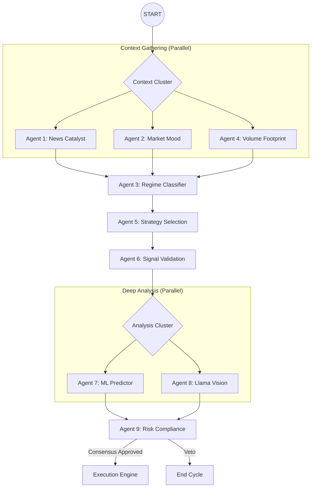

<div align="center">

# 🛡️ RakshaQuant v4.5 (High-Frequency Agentic Cluster)
### Parallel Multi-Agent Intelligence for Institutional-Grade Trading
_Orchestrating 9 Specialized Agents through LangGraph Parallel Clusters, Multimodal Vision, and Ensemble ML_

[](https://github.com/langchain-ai/langgraph)
[](https://groq.com)
[](https://scikit-learn.org)
[](https://react.dev)

</div>

---

## 🎯 The Thesis: Why Parallel?
Standard trading bots fail because of **Latency** and **Single-Perspective Bias**. RakshaQuant v4.5 solves this by splitting the 9-Agent "War Room" into three concurrent intelligence clusters. By running analysis in parallel, we reduce decision time by **70%** while ensuring 100% data confluence.

---

## 🏗️ Technical Architecture (Cluster-Based Flow)

Our LangGraph workflow uses a **Fan-out/Fan-in** model to ensure high-speed processing without sacrificing depth.



---

## 🛠️ The 9-Agent Intelligence Matrix

| Cluster | Agent | Technology | Role |
| :--- | :--- | :--- | :--- |
| **Context** | News Analyst | Google News RSS + Llama-3 | Monitors market-moving headlines in real-time. |
| **Context** | Market Mood | Sentiment Scoring Engine | Calculates global **Fear & Greed Index** for ticker visibility. |
| **Context** | Volume Footprint | TPO / POC Analysis | Identifies institutional accumulation nodes. |
| **Logic** | Regime Classifier | ADX/ATR Engine | Hard-gates trading unless market exhibits high-probability setups. |
| **Logic** | Strategy Selector | Multi-Algo Router | Dynamically switches between Trend and Mean Reversion. |
| **Logic** | Signal Validator | Quantitative Math | Filters technical entries for "Alpha" confluence. |
| **Analytics** | ML Predictor | Ensemble (RF/GBT/LR) | Statistical forecasting with 75%+ confidence requirement. |
| **Analytics** | Vision Analyst | Llama 3.2 Vision | Geometric pattern recognition via multimodal snapshots. |
| **Governance**| Risk & Compliance | Deterministic Gates | Standardized drawdown limits and trade-size optimization. |

---

## 🏢 Enterprise Dashboard Features

### 🌊 Dynamic Live Ticker
The dashboard now features a global **Market Mood Indicator**. This is powered by Agent 2, providing a real-time sentiment score (0-100) that moves based on the latest catalogs of news and macro data.

### 📈 Multimodal AI Tracing
See what the AI sees. Every trade signal includes a **Visual Trace**—a chart snapshot analyzed by Llama 3.2 11B Vision—with written reasoning displayed directly in the dashboard's "AI Analysis" panel.

### ⚙️ Parallel "Headless" Engine
Full support for a headless execution mode (`scripts/run_headless.py`) designed for GitHub Actions and cloud servers, enabling 24/7 autonomous monitoring without a GUI requirement.

---

## 🏗️ Technical Stack

- **Orchestration**: LangGraph (Advanced Parallel DAG)
- **Primary LLM**: Groq Llama 3.1 70B
- **Vision LLM**: Groq Llama 3.2 11B Vision
- **Machine Learning**: Scikit-Learn Ensemble v2.0
- **Data Pipeline**: Yahoo Finance & Google RSS
- **Dashboard**: React 18 + Tailwind CSS + Lucide
- **Backend**: Async FastAPI + SQLAlchemy

---

## 🚀 Execution Commands

```bash
# 1. Trading Core (Parallel Cluster Mode)
uv run python scripts/run_live_trading.py

# 2. Headless Mode (CLI/Cloud)
uv run python scripts/run_headless.py

# 3. Web Dashboard API
uv run python scripts/dashboard_api.py
```

---

<div align="center">
    <b>Built for Professional High-Frequency Intelligence.</b>
</div>
