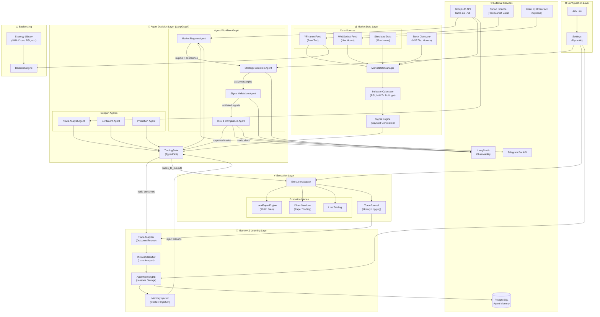
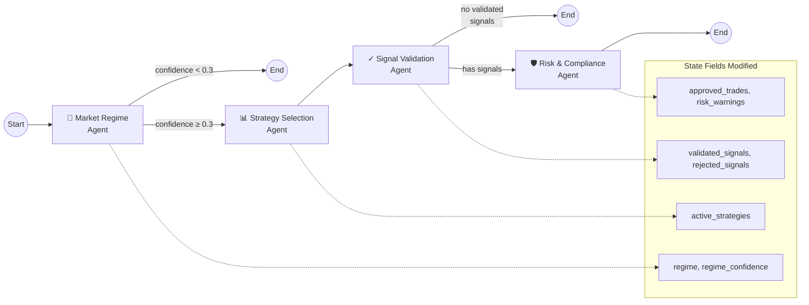
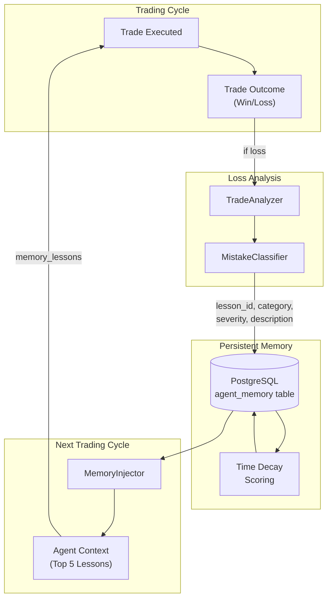

<div align="center">

# 🛡️ RakshaQuant

### Agentic Paper Trading System for NSE

_Where Large Language Models Meet Financial Markets_

[](https://www.python.org/downloads/)
[](https://github.com/langchain-ai/langgraph)
[](https://smith.langchain.com)
[](https://groq.com)
[](https://opensource.org/licenses/MIT)

</div>

---

## 🎯 About This Project

**RakshaQuant** (रक्षा = Protection in Sanskrit) is an autonomous agentic trading system designed for the Indian NSE market. It leverages **LangGraph** to orchestrate a team of specialized AI agents that analyze market data, formulate strategies, validate signals, and manage risk in real-time.

Unlike traditional algorithmic trading that relies solely on hardcoded logic, RakshaQuant introduces **cognitive flexibility**—using LLMs to reason about market regimes (bull/bear/ranging) and adapt its strategies accordingly.

### Key Capabilities

- **🤖 Cognitive Agents**: Multi-agent system that "thinks" before it trades
- **🌐 Live Market Analysis**: Real-time multi-stock monitoring via WebSocket
- **🛡️ Dynamic Risk Management**: Agents that can veto trades based on risk parameters
- **📊 Professional Dashboard**: Real-time CLI interface for monitoring agent thought processes
- **📝 Self-Improving Memory**: Learns from past mistakes using semantic memory
- **🆓 100% Free Tier Mode**: Paper trading without any paid API dependencies

---

## 🆕 What's New (v2.0)

### Free Tier Paper Trading

No paid broker API required! RakshaQuant now supports **100% free paper trading**:

| Feature             | Free Tier            | Description                              |
| ------------------- | -------------------- | ---------------------------------------- |
| **Market Data**     | ✅ YFinance          | Real NSE quotes (1-15 min delay)         |
| **Execution**       | ✅ Local Paper       | Virtual ₹10L wallet simulation           |
| **News Sentiment**  | ✅ Google RSS + Groq | AI-powered news analysis                 |
| **Stock Discovery** | ✅ Dynamic           | Finds trending stocks from news & movers |

### Dynamic Stock Discovery

No more hardcoded watchlists! The system now **automatically discovers** which stocks to trade based on:

- 📰 **News Mentions** - Scans Google News for trending stocks
- 📈 **Market Movers** - Identifies top gainers/losers

### New Modules

| Module                          | Purpose                               |
| ------------------------------- | ------------------------------------- |
| `src/utils/rate_limiter.py`     | Prevents Groq API rate limit errors   |
| `src/utils/cache.py`            | TTL cache for news, quotes, sentiment |
| `src/notifications/telegram.py` | Trade alerts on your phone            |
| `src/backtesting/`              | Test strategies on historical data    |
| `src/market/stock_discovery.py` | Dynamic stock discovery               |
| `src/execution/paper_engine.py` | Local paper trading engine            |

---

## 🏗️ Architecture

RakshaQuant uses a **hierarchical agent graph** where specialized agents collaborate to make trading decisions.

### System Overview



### Agent Workflow Detail

The 4-agent decision pipeline with conditional edges:



### Memory Feedback Loop

How the system learns from trade losses:



---

## ✨ Features

### 🤖 The Agent Team

| Agent                   | Responsibilities                                                                                         | Model (Groq)    |
| ----------------------- | -------------------------------------------------------------------------------------------------------- | --------------- |
| **Market Regime**       | Analyzes volatility and price action to determine if market is Trending (Up/Down), Ranging, or Volatile. | `llama-3.3-70b` |
| **Strategy Selection**  | Selects the best trading strategies (Momentum, Mean Reversion, etc.) for the current regime.             | `llama-3.3-70b` |
| **Signal Validation**   | Reviews technical signals against the current thesis to filter out false positives.                      | `llama-3.3-70b` |
| **Risk Manager**        | Deterministic agent that enforces position sizing, stop-losses, and kill switches.                       | _Rules Engine_  |
| **News Analyst** 🆕     | Scans Google News RSS and scores sentiment using AI.                                                     | `llama-3.3-70b` |
| **Sentiment Agent** 🆕  | Calculates Market Mood Index (0-100) for fear/greed signals.                                             | _Hybrid_        |
| **Prediction Agent** 🆕 | ML-based price direction prediction using Linear Regression.                                             | _scikit-learn_  |

### 🖥️ Professional Dashboard


A rich CLI dashboard built with `rich` providing real-time visibility into the system:

- **Market Overview**: Live ticker for 10+ NSE stocks
- **Agent Reasoning**: See _why_ the AI made a decision
- **P&L Tracking**: Real-time unrealized/realized profit monitoring
- **Visual Indicators**: Progress bars for trade confidence and win rates

### 🛡️ Robust Engineering

- **Live/Sim Switch**: Automatically switches to simulated data when markets are closed
- **Rate Limit Handling**: Token bucket rate limiter with exponential backoff
- **Caching**: TTL cache for news, quotes, and sentiment data
- **Confidence Scoring**: Every decision comes with a confidence score (0-100%)
- **Observability**: Full decision traces synced to LangSmith

---

## 🚀 Quick Start

### Prerequisites

- Python 3.12+
- [uv](https://github.com/astral-sh/uv) (recommended) or pip
- [Groq API Key](https://console.groq.com) (for LLM inference) - **FREE**
- [DhanHQ Account](https://dhan.co) (optional, for live trading only)

### Installation

```bash
# Clone the repository
git clone https://github.com/yourusername/RakshaQuant.git
cd RakshaQuant

# Install dependencies with uv (fast!)
uv sync

# Configure environment
cp .env.example .env
# Edit .env and add your API keys
```

### Configuration

Edit `.env` for your setup:

```bash
# Required
GROQ_API_KEY=your_groq_api_key

# Free Tier Mode (default)
MARKET_DATA_SOURCE=yfinance
EXECUTION_MODE=local_paper
PAPER_WALLET_BALANCE=1000000

# Optional: Telegram Alerts
TELEGRAM_BOT_TOKEN=your_bot_token
TELEGRAM_CHAT_ID=your_chat_id
```

### Running the System

**1. Check Configuration**

```bash
uv run python scripts/check_config.py
```

**2. Run Paper Trading Dashboard**

```bash
uv run python scripts/run_live_trading.py
```

**3. Run Backtest**

```bash
uv run python src/backtesting/engine.py
```

---

## 📁 Project Structure

```
RakshaQuant/
├── src/
│   ├── agents/              # 🧠 The "Brain" of the system
│   │   ├── market_regime.py
│   │   ├── strategy_selection.py
│   │   ├── signal_validation.py
│   │   ├── risk_compliance.py
│   │   ├── news_analyst.py  # 🆕 News sentiment
│   │   ├── sentiment.py     # 🆕 Market mood index
│   │   └── prediction.py    # 🆕 ML predictions
│   ├── market/              # 🌐 Market Data Handling
│   │   ├── manager.py       # Live/Sim auto-switcher
│   │   ├── yfinance_feed.py # 🆕 Free market data
│   │   ├── stock_discovery.py # 🆕 Dynamic discovery
│   │   ├── websocket_feed.py# DhanHQ WebSocket client
│   │   └── simulated_data.py# Realistic market simulator
│   ├── execution/           # ⚡ Order Execution
│   │   ├── adapter.py       # Execution routing
│   │   └── paper_engine.py  # 🆕 Local paper trading
│   ├── backtesting/         # 📈 Strategy Testing
│   │   ├── engine.py        # 🆕 Backtest runner
│   │   └── strategies.py    # 🆕 Pre-built strategies
│   ├── utils/               # 🔧 Utilities
│   │   ├── rate_limiter.py  # 🆕 API rate limiting
│   │   └── cache.py         # 🆕 TTL caching
│   ├── notifications/       # 📱 Alerts
│   │   └── telegram.py      # 🆕 Mobile notifications
│   ├── dashboard/           # 📊 UI Components
│   │   └── cli.py           # Rich terminal dashboard
│   ├── memory/              # 📚 Learning System
│   └── config/              # ⚙️ Configuration
├── scripts/                 # 🏃‍♂️ Entry Points
│   ├── run_live_trading.py  # Main application
│   └── check_config.py      # 🆕 Config validator
├── tests/                   # 🧪 Unit Tests
└── README.md
```

---

## 📈 Backtesting

Test strategies before running live:

```python
from src.backtesting import BacktestEngine, MomentumStrategy

engine = BacktestEngine(initial_capital=100000)
data = engine.fetch_data("RELIANCE", period="1y")
result = engine.run(MomentumStrategy(), data, symbol="RELIANCE")
result.print_summary()
```

**Available Strategies:**

- `MomentumStrategy` - Buy on upward momentum
- `MeanReversionStrategy` - Buy oversold, sell overbought
- `SMACrossoverStrategy` - Moving average crossover
- `RSIStrategy` - RSI-based entries

---

## 📱 Telegram Alerts

Get trade notifications on your phone:

1. Create bot: Talk to `@BotFather` on Telegram
2. Get chat ID: Talk to `@userinfobot`
3. Add to `.env`:

```bash
TELEGRAM_BOT_TOKEN=your_bot_token
TELEGRAM_CHAT_ID=your_chat_id
```

---

## 🔍 Observability

RakshaQuant is instrumented with **LangSmith** for full observability. You can trace every thought process of the agents:

> _"Why did the agent reject the BUY signal for TCS?"_ > _"What market regime did it detect before entering the trade?"_

All these questions can be answered by inspecting the traces in the LangSmith dashboard.

---

## ⚠️ Disclaimer

> **EDUCATIONAL PURPOSES ONLY**
>
> RakshaQuant is a research project to explore Agentic AI in finance. It is **not** financial advice.
>
> - The default mode is **PAPER TRADING**.
> - Do not connect to a live trading account with real funds unless you fully understand the risks.
> - Algorithmic trading involves significant risk of loss.

---

<div align="center">
    <b>Built with ❤️ by a solo developer exploring the BFSI × AI frontier</b>
</div>

