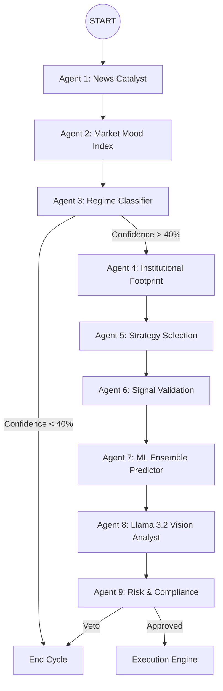

<div align="center">

# 🛡️ RakshaQuant v4.0 (Enterprise)
### Autonomous Agentic Intelligence for High-Probability Trading
_Orchestrating 9 Specialized Agents through LangGraph, Multimodal Vision, and Ensemble ML_

[](https://react.dev)
[](https://github.com/langchain-ai/langgraph)
[](https://groq.com)
[](https://scikit-learn.org)
[](https://fastapi.tiangolo.com)

</div>

---

## 🎯 Project Thesis
**RakshaQuant** (रक्षा = Protection) is an autonomous agentic trading ecosystem designed to solve the "Black Box" problem in algorithmic trading. Most bots fail because they rely on single-dimensionality (e.g., just indicators). 

RakshaQuant utilizes a **9-Agent "War Room"** architecture. By the time a trade is executed, it has been scrutinized by a News analyst, visual patterns have been "seen" by a Vision model, statistical probability has been verified by an ML Ensemble, and institutional liquidity has been mapped.

---

## 🏗️ Detailed Architecture

### 🧠 The Intelligence Orchestration Layer (LangGraph)
Unlike linear scripts, RakshaQuant uses a **Directed Acyclic Graph (DAG)** to manage state. Every agent node receives the `TradingState`, performs its specific specialized task, and passes the context forward.



---

## 🛠️ The 9-Agent "War Room"

| # | Agent | Logic | Purpose |
| :--- | :--- | :--- | :--- |
| 1 | **News Analyst** | RSS + Llama-3 Sentiment | Identifies market-moving catalysts (Earnings, Macro). |
| 2 | **Market Mood** | Collective Sentiment Scores | Calculates a global **Fear & Greed Index** (0-100). |
| 3 | **Regime Classifier** | ADX + ATR + LLM Reasoning | Defines if the market is Bullish, Bearish, or Ranging. |
| 4 | **Volume Footprint** | TPO / Volume Profiling | Maps institutional Point of Control (PoC) and Value Areas. |
| 5 | **Strategy Selector** | Multi-Algo Routing | Pivots logic (Trend Following vs. Mean Reversion). |
| 6 | **Signal Validator** | Quantitative Math | Cross-checks EMA/RSI clusters for confluence. |
| 7 | **ML Predictor** | Ensemble (RF + GBT + LR) | Statistical price forecasting with confidence scores. |
| 8 | **Vision Analyst** | Llama 3.2 Vision | "Sees" geometric chart patterns (Flags, Wedges). |
| 9 | **Risk Compliance** | Deterministic Hard Gates | The final veto based on drawdown and drawdown limits. |

---

## 🏢 Enterprise Dashboard Features

### 📈 Machine Learning Analytics
A dedicated ML dashboard section showing directional forecasts from our **Ensemble Classifier**. It breaks down the confidence level and reasoning from the RandomForest and Gradient Boosting models, ensuring no trade is taken against statistical odds.

### 👁️ Multimodal Visual Trace
The system generates SVG charts of current price action, encodes them, and sends them to **Llama 3.2 Vision**. The agent's visual reasoning logs are displayed in the "AI Analysis" tab, allowing you to see *why* it thinks a pattern looks bullish/bearish.

### 🌊 Institutional Liquidity Tracker
Uses high-precision volume distribution to find "High Volume Nodes." Trading occurs only when price is interacting with institutional value areas.

### 📉 Global Kill-Switch
A centralized emergency mechanism that instantly shuts down all agents, closes all open positions, and prevents further execution if system-wide anomalies or drawdown limits are hit.

---

## 🏗️ Technical Stack

- **Core Engine**: Python 3.12+ managed via `uv`
- **Orchestration**: LangGraph (LangChain ecosystem)
- **Primary LLMs**: Groq (Llama 3.1 70B & Llama 3.2 11B Vision)
- **ML Layer**: Scikit-Learn (Ensemble Regressors/Classifiers)
- **Data Pipeline**: Yahoo Finance & Interactive Brokers (via MarketDataManager)
- **Backend API**: FastAPI (High-performance async server)
- **Frontend**: React 18, Tailwind CSS, Lucide Icons, Glassmorphism design
- **State Persistence**:Local SQLite (AgentMemoryDB)

---

## 🚀 Getting Started

### 1. Requirements
- Groq API Key (Register at [console.groq.com](https://console.groq.com))
- Python 3.12+
- Node.js 18+

### 2. Deployment
```bash
# Clone the repository
git clone https://github.com/yourusername/RakshaQuant.git
cd RakshaQuant

# Initialize Backend
uv sync
cp .env.example .env # Add your GROQ_API_KEY

# Initialize Dashboard
cd frontend && npm install
```

### 3. Execution
```bash
# Terminal A: Trading Core
uv run python scripts/run_live_trading.py

# Terminal B: Web API
uv run python scripts/dashboard_api.py

# Terminal C: UI Development Server
cd frontend && npm run dev
```

---

## ⚠️ Risk Disclosure
> **FOR RESEARCH ONLY.**
> RakshaQuant is an experimental software suite. Algorithmic trading involves significant capital risk. The default "Paper Trading" mode should be used extensively before considering live capital integration.

---

<div align="center">
    <b>Built for Professional Quant Intelligence.</b>
</div>
